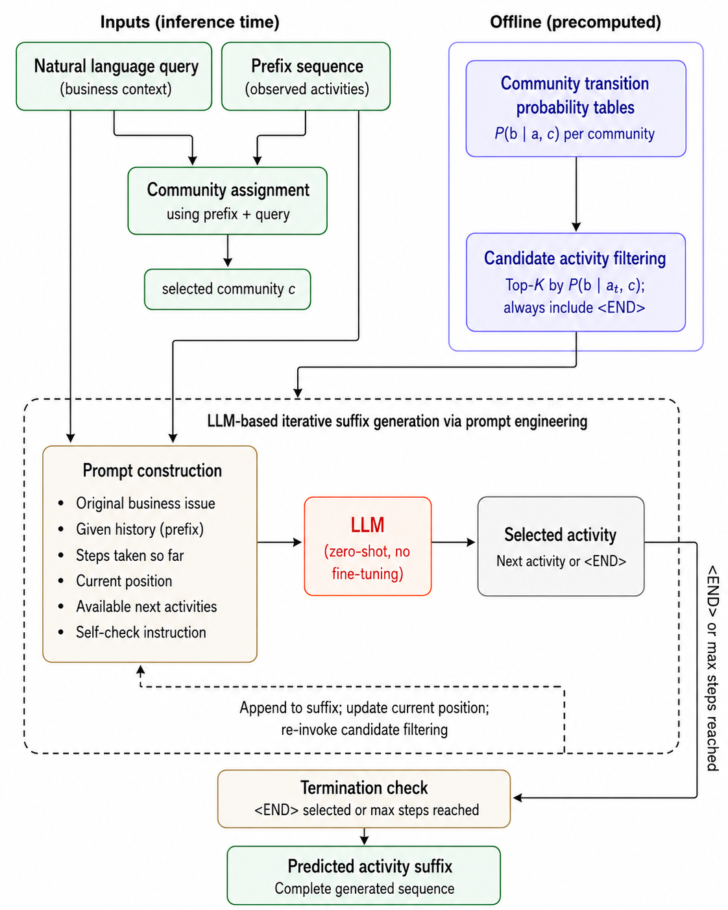

# Transition Probability-Guided LLM Reasoning for Zero-Shot Process Suffix Generation
### Application to Purchase-to-Pay Processes

**Ho Jun Park** | Industrial and Information Systems Engineering, Soongsil University

---

<p align="center">
  
</p>

---

## Overview

Predictive Process Monitoring (PPM) aims to anticipate how an ongoing business process will unfold by generating the remaining sequence of activities (the *activity suffix*) from an observed prefix. State-of-the-art supervised approaches require large historical event logs for training and are structurally limited to the prefix sequence — they predict the most statistically likely continuation from historical patterns, with no mechanism to account for the actual business context of a running case.

**The problem:** Two cases with identical prefix sequences may require entirely different resolution paths depending on the underlying business situation. In exception-handling scenarios — where a process deviates from its canonical flow due to a price mismatch, invoice dispute, or payment block — the correct resolution depends on *why* the deviation occurred, not just *what* has happened in the log. Supervised models cannot distinguish between these cases.

**Our approach (TPGLR):** Process participants already possess contextual knowledge about their current situation. TPGLR (**T**ransition **P**robability-**G**uided **L**LM **R**easoning) captures this knowledge through a natural language query and combines it with transition probability-based candidate filtering to guide an LLM in generating the activity suffix step by step — without any model training, expert annotation, or narrative template design.

The framework has three components:

1. **Community-based transition probabilities** computed offline from the historical event log, capturing different behavioral patterns within the same process.
2. **Top-K candidate filtering** at each generation step, restricting the LLM's choices to activities that are empirically attested as successors in the current process community.
3. **LLM-based iterative suffix generation** via prompt engineering, where a structured prompt provides the business context query, the observed prefix, and the candidate list to a pretrained LLM.

---

## Key Results

Evaluated on the [BPI Challenge 2019](https://doi.org/10.4121/uuid:d06aff4b-79f0-45e6-8ec8-e19730c248f1) dataset (1,595,923 events, 251,734 cases, 42 activities) using 180 manually curated question-answer instances spanning six exception-handling event categories.

All metrics are reproduced from the saved per-instance predictions in `results/` by
`src/evaluate/compute_metrics.py` (see [Usage](#usage)). DL similarity is the
length-normalized Damerau-Levenshtein similarity (insertions, deletions,
substitutions, and adjacent transpositions); F1 is multiset (bag-of-activities)
overlap.

### Overall performance

| Method | DL Similarity | F1 |
| --- | --- | --- |
| SuTraN (2024) | 0.403 | 0.529 |
| Tax LSTM (2017) | 0.507 | 0.634 |
| LLM-only (ablation) | 0.661 | 0.786 |
| **TPGLR (ours)** | **0.726** | **0.839** |

TPGLR outperforms the strongest supervised baseline (SuTraN) by **31.0 percentage points** in F1 and **32.3 points** in DL similarity, and improves over the LLM-only ablation (no candidate filtering) by 5.3 and 6.5 points respectively.

### Per-category breakdown (DL similarity / F1)

| Event Category | SuTraN | Tax LSTM | LLM-only | TPGLR |
| --- | --- | --- | --- | --- |
| Cancel Invoice Receipt | 0.391 / 0.528 | 0.606 / 0.669 | 0.553 / 0.717 | **0.628 / 0.762** |
| Change Delivery Indicator | 0.368 / 0.461 | 0.461 / 0.553 | 0.530 / 0.661 | **0.604 / 0.761** |
| Change Price | 0.425 / 0.604 | 0.551 / 0.699 | 0.637 / 0.752 | **0.739 / 0.838** |
| Change Quantity | 0.384 / 0.497 | 0.484 / 0.617 | 0.638 / 0.776 | **0.676 / 0.802** |
| Remove Payment Block | 0.421 / 0.541 | 0.590 / 0.696 | 0.817 / 0.906 | **0.873 / 0.948** |
| Vendor creates debit memo | 0.465 / 0.598 | 0.330 / 0.545 | 0.717 / 0.837 | **0.832 / 0.914** |

TPGLR is strictly best on every category for both metrics.

### Exact-match and full-recall rates

Beyond aggregate similarity, we report two stricter sequence-level criteria over
all 180 instances:

- **Perfect match** — the generated suffix equals the ground-truth suffix exactly.
- **Perfect recall** — every ground-truth activity appears in the generated suffix (recall = 1.0).

| Method | Perfect match | Perfect recall |
| --- | --- | --- |
| SuTraN (2024) | 11 / 180 (6.1%) | 35 / 180 (19.4%) |
| Tax LSTM (2017) | 30 / 180 (16.7%) | 52 / 180 (28.9%) |
| LLM-only (ablation) | 52 / 180 (28.9%) | 113 / 180 (62.8%) |
| **TPGLR (ours)** | **75 / 180 (41.7%)** | **118 / 180 (65.6%)** |

TPGLR reproduces the ground-truth suffix exactly on 41.7% of cases — nearly 7× the
SuTraN rate — and recovers the full set of required activities on 65.6%.

> **Note on the LLM-only ablation.** One of the 180 instances (`Vendor creates debit
> memo`) returned no output during the LLM-only run due to a transient API error
> (HTTP 529, server overload). DL similarity and F1 for LLM-only are averaged over
> the 179 instances that produced an output; the perfect-match and perfect-recall
> rates are reported out of the full 180. TPGLR has outputs for all 180 instances.

---

## Project Structure

```
p2p-process-suffix-generation/
├── assets/                   # Figures (framework architecture, etc.)
├── data/
│   ├── qa_dataset_final.pkl              # 180 QA instances
│   ├── transitions/                      # Per-community transition probabilities
│   └── BPI_Challenge_2019.xes            # (place the raw log here)
├── models/                   # Trained baseline models
├── results/                  # Per-instance evaluation outputs (.pkl files)
├── src/
│   ├── experiment/
│   │   └── claude_experiment_final2.py    # TPGLR main script
│   ├── baselines/
│   │   ├── tax_lstm_torch.py              # Tax LSTM baseline
│   │   └── sutran_qa_eval.py              # SuTraN evaluation wrapper
│   └── evaluate/
│       └── compute_metrics.py             # Reproduces all result tables from results/
├── meta.pkl                  # Pre-computed transition probabilities and community assignments
├── .gitignore
└── README.md
```

---

## Setup

1. **Clone the repository**
   ```bash
   git clone https://github.com/hojunparkme/p2p-process-suffix-generation.git
   cd p2p-process-suffix-generation
   ```

2. **Install dependencies**
   ```bash
   pip install anthropic python-dotenv numpy pm4py torch
   ```

3. **Set up the API key**

   Create a `.env` file in the repository root:
   ```
   ANTHROPIC_API_KEY=your_api_key_here
   ```

4. **Download the dataset**

   Download [BPI Challenge 2019](https://doi.org/10.4121/uuid:d06aff4b-79f0-45e6-8ec8-e19730c248f1) and place `BPI_Challenge_2019.xes` in the `data/` directory.

---

## Usage

### Reproduce all result tables

The saved predictions in `results/` are enough to regenerate every table above —
no API key or dataset download required:

```bash
python src/evaluate/compute_metrics.py
```

### Run the TPGLR framework
```bash
cd src/experiment
python claude_experiment_final2.py
```

### Run baselines

**Tax LSTM**:
```bash
cd src/baselines
python tax_lstm_torch.py
```

**SuTraN** (requires the [official repository](https://github.com/BrechtWts/SuffixTransformerNetwork)):
```bash
cd src/baselines
python sutran_qa_eval.py
```

---

## Notes on the Dataset

The BPI Challenge 2019 log has known characteristics that affect supervised PPM evaluation:

- **Extraction bias**: As reported by Wuyts et al. (SuTraN, 2024), the average throughput time drops sharply after September 2018, reflecting a change in the data extraction regime rather than an underlying process change. Standard chronological train-test splits therefore produce a test set systematically biased toward shorter cases. The SuTraN authors developed a workaround split procedure to mitigate this bias.
- **Short and variable traces**: The average case length is 6.34 events, with substantial variation across cases. This makes supervised deep learning methods particularly sensitive to preprocessing choices.

These properties make BPIC 2019 a useful benchmark for testing whether a method can generalize beyond purely statistical pattern matching — which is precisely what TPGLR is designed to do.

---

## Citation

```bibtex
@unpublished{park2026tpglr,
  title  = {Transition Probability-Guided LLM Reasoning for Zero-Shot Process Suffix Generation: Application to Purchase-to-Pay Processes},
  author = {Park, Ho Jun and Lee, Younsoo and Kang, Changmuk},
  year   = {2026},
  note   = {Manuscript in preparation}
}
```

---

## Related Work

- van der Aalst et al. (2011) — Process Mining Manifesto, BPM Workshops
- Tax et al. (2017) — Predictive Business Process Monitoring with LSTM Neural Networks, CAiSE
- Marquez-Chamorro et al. (2018) — Predictive Monitoring of Business Processes: A Survey, IEEE TSC
- Bukhsh et al. (2021) — ProcessTransformer: Predictive Business Process Monitoring with Transformer Network
- Rama-Maneiro et al. (2021) — Deep Learning for Predictive Business Process Monitoring: Review and Benchmark, IEEE TSC
- Weytjens & De Weerdt (2022) — Creating Unbiased Public Benchmark Datasets with Data Leakage Prevention for PPM
- Wuyts et al. (2024) — SuTraN: Encoder-Decoder Transformer for Suffix Prediction, ICPM
- Pasquadibisceglie et al. (2024) — LUPIN: LLM Approach for Activity Suffix Prediction, ICPM
- Oved et al. (2025) — SNAP: Semantic Stories for Next Activity Prediction, AAAI
- Casciani et al. (2026) — Enhancing Next Activity Prediction with RAG, Information Systems
- Park, Lee & Kang (in press) — Structure-Preserving Process Case Embeddings via Directed Graph Convolutional Networks, ICIC Express Letters
- van Dongen (2019) — BPI Challenge 2019 Dataset, 4TU.ResearchData

---

## License

This project is released under the MIT License. See [LICENSE](LICENSE) for details.

---

## Contact

For questions about the code or the manuscript, please open an issue or contact the author.
