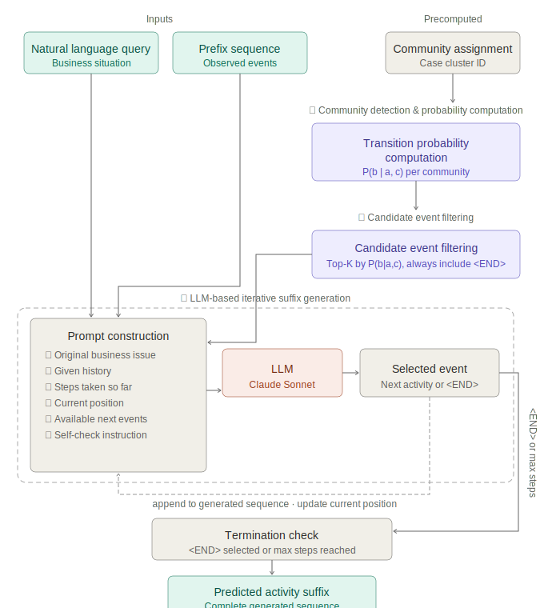

# Zero-Shot Process Suffix Generation via Transition Probability-Guided LLM Reasoning

**Author:** Ho Jun Park, Younsoo Lee, Changmuk Kang
Department of Industrial and Information Systems Engineering, Soongsil University

---

---

## Overview

A zero-shot framework for activity suffix generation in Purchase-to-Pay (P2P) business processes. Unlike supervised approaches that rely solely on prefix sequences, our method accepts a **natural language query** describing the current business situation alongside **transition probability-based candidates**, enabling an LLM to generate contextually appropriate activity suffixes without training or annotation.

---

## Results

| Method | DL Similarity | F1 |
|---|---|---|
| SuTraN (2024) | 0.403 | 0.529 |
| Tax LSTM (2017) | 0.507 | 0.634 |
| LLM-only (ablation) | 0.652 | 0.786 |
| **Ours** | **0.714** | **0.839** |

| Event Category | SuTraN | Tax LSTM | LLM-only | Ours |
|---|---|---|---|---|
| Cancel Invoice Receipt | 0.391 / 0.528 | 0.606 / 0.669 | 0.531 / 0.717 | **0.606 / 0.762** |
| Change Delivery Indicator | 0.368 / 0.461 | 0.461 / 0.553 | 0.530 / 0.661 | **0.604 / 0.761** |
| Change Price | 0.425 / 0.604 | 0.551 / 0.699 | 0.637 / 0.752 | **0.729 / 0.838** |
| Change Quantity | 0.384 / 0.497 | 0.484 / 0.617 | 0.623 / 0.776 | **0.666 / 0.802** |
| Remove Payment Block | 0.421 / 0.541 | 0.590 / 0.696 | 0.817 / 0.906 | **0.854 / 0.948** |
| Vendor creates debit memo | 0.465 / 0.598 | 0.330 / 0.545 | 0.696 / 0.837 | **0.813 / 0.914** |

*(DL Similarity / F1)*

---

## Setup

1. Clone the repository

        git clone https://github.com/hojunparkme/p2p-process-suffix-generation.git

2. Install dependencies

        pip install anthropic python-dotenv numpy

3. Create `.env` file

        ANTHROPIC_API_KEY=your_api_key_here

4. Download [BPI Challenge 2019](https://doi.org/10.4121/uuid:d06aff4b-79f0-45e6-8ec8-e19730c248f1) and place `BPI_Challenge_2019.xes` in `data/`

---

## Usage

Run our framework:

    cd src/experiment && python claude_experiment_final2.py

Run Tax LSTM baseline:

    cd src/baselines && python tax_lstm_torch.py

SuTraN evaluation (requires [official repo](https://github.com/BrechtWts/SuffixTransformerNetwork)):

    cd src/baselines && python sutran_qa_eval.py

---

## Citation

    @article{park2025p2p,
      title={Zero-Shot Process Suffix Generation via Transition Probability-Guided LLM Reasoning in Purchase-to-Pay Processes},
      author={Park, Ho Jun and Lee, Younsoo and Kang, Changmuk},
      year={2025}
    }

---

## Related Work
- [SuTraN](https://github.com/BrechtWts/SuffixTransformerNetwork) - Wuyts et al., ICPM 2024
- [LUPIN](https://github.com/vinspdb/LUPIN) - Pasquadibisceglie et al., ICPM 2024
- [BPI Challenge 2019](https://doi.org/10.4121/uuid:d06aff4b-79f0-45e6-8ec8-e19730c248f1)
